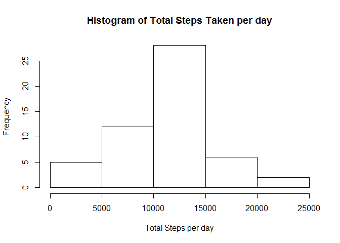
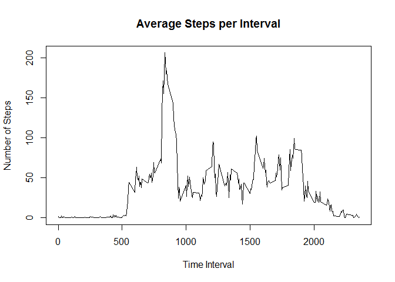
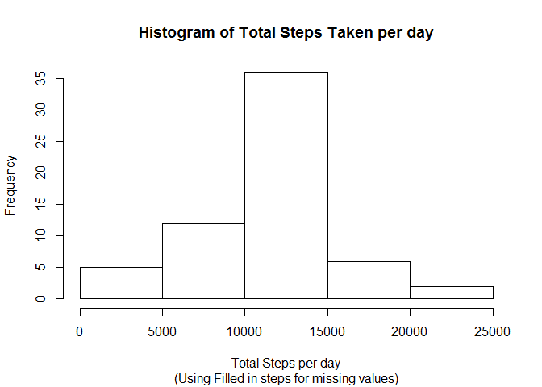
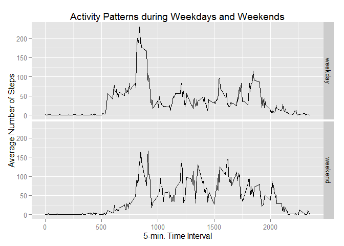

# Reproducible Research: Peer Assessment 1
***


## About the Data
The data was downloaded from the course web site:

Dataset: [Activity monitoring data](https://d396qusza40orc.cloudfront.net/repdata%2Fdata%2Factivity.zip) [52K]
The variables included in this dataset are:

- steps: Number of steps taking in a 5-minute interval (missing values are coded as NA)
- date: The date on which the measurement was taken in YYYY-MM-DD format
- interval: Identifier for the 5-minute interval in which measurement was taken

The dataset is stored in a comma-separated-value (CSV) file and there are a total of 17,568 observations in this dataset.

The data file (activity.csv) was extracted from the downloaded Zip file (repdata-data-activity.zip) and copied to the project folder.

## Loading and preprocessing the data

#### 1.Load the data
This involves the following:  
- Setting the working directory to the project folder  
- Reading the data file into a data frame tbl, using the dplyr library  
- Check the data  


```r
library(dplyr, warn.conflicts = FALSE)
library(lubridate)

setwd("C:/Users/skolan01/Documents/Coursera/Reproducible_Research/Assignment1/RepData_PeerAssessment1")
df <- read.table("activity.csv", header = TRUE, sep = ",")
ds <- tbl_df(df)
```

#### 2. Process/Transform the data (if necessary) into a format suitable for your analysis
Check/Inspect the Data using the **dim**, **head**, and **str** functions.


```r
dim(ds)
```

```
## [1] 17568     3
```

```r
head(ds)
```

```
## Source: local data frame [6 x 3]
## 
##   steps       date interval
##   (int)     (fctr)    (int)
## 1    NA 2012-10-01        0
## 2    NA 2012-10-01        5
## 3    NA 2012-10-01       10
## 4    NA 2012-10-01       15
## 5    NA 2012-10-01       20
## 6    NA 2012-10-01       25
```

```r
str(ds)
```

```
## Classes 'tbl_df', 'tbl' and 'data.frame':	17568 obs. of  3 variables:
##  $ steps   : int  NA NA NA NA NA NA NA NA NA NA ...
##  $ date    : Factor w/ 61 levels "2012-10-01","2012-10-02",..: 1 1 1 1 1 1 1 1 1 1 ...
##  $ interval: int  0 5 10 15 20 25 30 35 40 45 ...
```

Convert Date from Factor to Date, using lubridate's **ymd** function


```r
ds$date <- as.Date(ymd(ds$date))
str(ds)
```

```
## Classes 'tbl_df', 'tbl' and 'data.frame':	17568 obs. of  3 variables:
##  $ steps   : int  NA NA NA NA NA NA NA NA NA NA ...
##  $ date    : Date, format: "2012-10-01" "2012-10-01" ...
##  $ interval: int  0 5 10 15 20 25 30 35 40 45 ...
```

## What is mean total number of steps taken per day?

#### 1. Calculate the total number of steps taken per day


```r
# Use the dplyr group_by() to create a grouped table: By Date
activity_dates <- group_by(ds, date)

# Determine the average steps for each group
total_steps_per_day <- summarize(activity_dates, steps = sum(steps))
print(total_steps_per_day)
```

```
## Source: local data frame [61 x 2]
## 
##          date steps
##        (date) (int)
## 1  2012-10-01    NA
## 2  2012-10-02   126
## 3  2012-10-03 11352
## 4  2012-10-04 12116
## 5  2012-10-05 13294
## 6  2012-10-06 15420
## 7  2012-10-07 11015
## 8  2012-10-08    NA
## 9  2012-10-09 12811
## 10 2012-10-10  9900
## ..        ...   ...
```

#### 2. Make a histogram of the total number of steps taken each day

```r
hist(total_steps_per_day$steps, 
     main = "Histogram of Total Steps Taken per day", 
     xlab = "Total Steps per day")
```

 

#### 3. Calculate and report the mean and median of the total number of steps taken per day

```r
mean_steps <- mean(total_steps_per_day$steps, na.rm = TRUE)
print(mean_steps)
```

```
## [1] 10766.19
```

```r
median_steps <- median(total_steps_per_day$steps, na.rm = TRUE)
print(median_steps)
```

```
## [1] 10765
```

Mean of total number of steps taken per day: **10766.19**  
Median of total number of steps taken per day: **10765**

***

## What is the average daily activity pattern?
#### 1. Make a time series plot (i.e. type = "l") of the 5-minute interval (x-axis) and the average number of steps taken, averaged across all days (y-axis)


```r
# Use the dplyr group_by() to create a grouped table: By Interval
by_interval <- group_by(ds, interval)

# Determine the average steps for each group
avg_steps_per_interval <- summarize(by_interval, avg_steps = mean(steps, na.rm = TRUE))
head(avg_steps_per_interval)
```

```
## Source: local data frame [6 x 2]
## 
##   interval avg_steps
##      (int)     (dbl)
## 1        0 1.7169811
## 2        5 0.3396226
## 3       10 0.1320755
## 4       15 0.1509434
## 5       20 0.0754717
## 6       25 2.0943396
```

```r
# Plot
plot(avg_steps_per_interval$interval, 
     avg_steps_per_interval$avg_steps, 
     type = "l", 
     main = "Average Steps per Interval", 
     xlab = "Time Interval", 
     ylab = "Number of Steps")
```

 

#### 2. Determine Which 5-minute interval, on average across all the days in the dataset, contains the maximum number of steps
This is accomplished using dplyr's filter function as follows:


```r
max_steps <- filter(avg_steps_per_interval, avg_steps == max(avg_steps))
print(max_steps)
```

```
## Source: local data frame [1 x 2]
## 
##   interval avg_steps
##      (int)     (dbl)
## 1      835  206.1698
```
Interval **835** had the maximum number of steps (**206.1698113**) on average across all days

***

## Inputing missing values
#### 1. Calculate and report the total number of missing values in the dataset (i.e. the total number of rows with NAs)


```r
num_nas <- sum(is.na(ds$steps))
print(num_nas)
```

```
## [1] 2304
```

There are **2304** missing rows in the dataset, out of a total of **17568** observations.


#### 2. Devise a strategy for filling in all of the missing values in the dataset. The strategy does not need to be sophisticated. For example, you could use the mean/median for that day, or the mean for that 5-minute interval, etc.

Missing (NA) values will be filled in using the mean for that 5-minute interval.


#### 3. Create a new dataset that is equal to the original dataset but with the missing data filled in.


```r
ds2 <- inner_join(ds, avg_steps_per_interval, by = "interval" )
head(ds2)
```

```
## Source: local data frame [6 x 4]
## 
##   steps       date interval avg_steps
##   (int)     (date)    (int)     (dbl)
## 1    NA 2012-10-01        0 1.7169811
## 2    NA 2012-10-01        5 0.3396226
## 3    NA 2012-10-01       10 0.1320755
## 4    NA 2012-10-01       15 0.1509434
## 5    NA 2012-10-01       20 0.0754717
## 6    NA 2012-10-01       25 2.0943396
```

```r
# Add a second column named steps_filled, which will contain the 'filled in' values
# Populate this with values in steps to start with
ds2 <- mutate(ds2, steps_filled = steps)

# Update NA values with the average values for that interval
ds2$steps_filled[is.na(ds2$steps_filled)] <- ds2$avg_steps
```

```
## Warning in ds2$steps_filled[is.na(ds2$steps_filled)] <- ds2$avg_steps:
## number of items to replace is not a multiple of replacement length
```

```r
head(ds2)
```

```
## Source: local data frame [6 x 5]
## 
##   steps       date interval avg_steps steps_filled
##   (int)     (date)    (int)     (dbl)        (dbl)
## 1    NA 2012-10-01        0 1.7169811    1.7169811
## 2    NA 2012-10-01        5 0.3396226    0.3396226
## 3    NA 2012-10-01       10 0.1320755    0.1320755
## 4    NA 2012-10-01       15 0.1509434    0.1509434
## 5    NA 2012-10-01       20 0.0754717    0.0754717
## 6    NA 2012-10-01       25 2.0943396    2.0943396
```

#### 4. Make a histogram of the total number of steps taken each day and Calculate and report the mean and median total number of steps taken per day. Do these values differ from the estimates from the first part of the assignment? What is the impact of inputing missing data on the estimates of the total daily number of steps?


```r
# Use the dplyr group_by() to create a grouped table: By Date
by_date <- group_by(ds2, date)

# Determine the average steps for each group
total_steps_per_day2 <- summarize(by_date, total_steps = sum(steps_filled))
head(total_steps_per_day2)
```

```
## Source: local data frame [6 x 2]
## 
##         date total_steps
##       (date)       (dbl)
## 1 2012-10-01    10766.19
## 2 2012-10-02      126.00
## 3 2012-10-03    11352.00
## 4 2012-10-04    12116.00
## 5 2012-10-05    13294.00
## 6 2012-10-06    15420.00
```

```r
# Plot the histogram
hist(total_steps_per_day2$total_steps, 
     main = "Histogram of Total Steps Taken per day", 
     sub = "(Using Filled in steps for missing values)",
     xlab = "Total Steps per day")
```

 

```r
# Calculate the Mean and Median
mean_steps2 <- mean(total_steps_per_day2$total_steps, na.rm = TRUE)
median_steps2 <- median(total_steps_per_day2$total_steps, na.rm = TRUE)
```

Scenario   | Mean  | Median
-----------|-------| -------
Data as is  |10766.19|10765
NA values Filled in using averages    |10766.19|10766.19

Based on the above summary, there is no change in the mean.  However, the Median has increased.  

***

## Are there differences in activity patterns between weekdays and weekends?
#### 1. Create a new factor variable in the dataset with two levels - "weekday" and "weekend" indicating whether a given date is a weekday or weekend day.

Add and populate a Day of the week column (dow) using the weekdays() function  


```r
# Add and populate a Day of the week column (dow) using the weekdays() function
ds3 <- mutate(ds2, dow = weekdays(date, abbreviate = TRUE))

# Add and populate day_type column
ds3 <- mutate(ds3, day_type = ifelse(dow == "Sat" | dow == "Sun", "weekend", "weekday"))

# Change column type from character to factor
ds3$day_type <- as.factor(ds3$day_type)
head(ds3)
```

```
## Source: local data frame [6 x 7]
## 
##   steps       date interval avg_steps steps_filled   dow day_type
##   (int)     (date)    (int)     (dbl)        (dbl) (chr)   (fctr)
## 1    NA 2012-10-01        0 1.7169811    1.7169811   Mon  weekday
## 2    NA 2012-10-01        5 0.3396226    0.3396226   Mon  weekday
## 3    NA 2012-10-01       10 0.1320755    0.1320755   Mon  weekday
## 4    NA 2012-10-01       15 0.1509434    0.1509434   Mon  weekday
## 5    NA 2012-10-01       20 0.0754717    0.0754717   Mon  weekday
## 6    NA 2012-10-01       25 2.0943396    2.0943396   Mon  weekday
```
  

#### 2. Make a panel plot containing a time series plot (i.e. type = "l") of the 5-minute interval (x-axis) and the average number of steps taken, averaged across all weekday days or weekend days (y-axis)


```r
# Use the dplyr group_by() to create a grouped table: By day_type and interval
by_type_and_interval <- group_by(ds3, day_type, interval)

# Determine the average steps for each group
avg_steps_per_interval3 <- summarize(by_type_and_interval, avg_steps = mean(steps_filled, na.rm = TRUE))
head(avg_steps_per_interval3)
```

```
## Source: local data frame [6 x 3]
## Groups: day_type [1]
## 
##   day_type interval  avg_steps
##     (fctr)    (int)      (dbl)
## 1  weekday        0 2.25115304
## 2  weekday        5 0.44528302
## 3  weekday       10 0.17316562
## 4  weekday       15 0.19790356
## 5  weekday       20 0.09895178
## 6  weekday       25 1.59035639
```

```r
library(ggplot2)

p <- ggplot(avg_steps_per_interval3, aes(interval, avg_steps)) +
    geom_line() +
    facet_grid(day_type ~ .) +
    ggtitle("Activity Patterns during Weekdays and Weekends") +
    labs(y = "Average Number of Steps",
         x = "5-min. Time Interval")

p
```

 

Based on the plots, there is more activity in the early morning hours during the weekdays.  On the weekends, the activities are spread out throughout the day.  This makes sense, as people are likely to exercise prior to going to work on weekdays, and are free to exercise any time of the day during the weekend.

